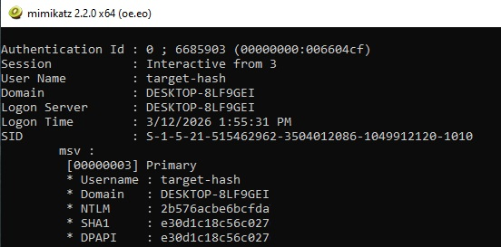
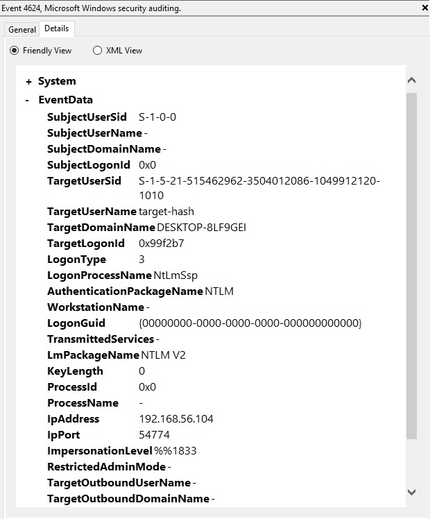
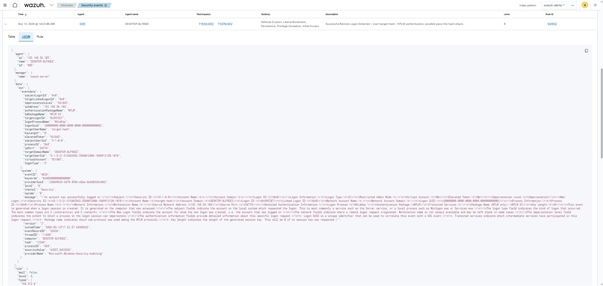

> [Back to SOC Portfolio](https://github.com/MoisesDaMata?tab=repositories)

---

# Detecting Pass-the-Hash Authentication — NTLM Credential Abuse

> **Lab Type:** Threat Detection | **Platform:** Wazuh SIEM | **Difficulty:** Intermediate

---

## Objective

This lab demonstrates how a **Security Operations Center (SOC)** can detect a **Pass-the-Hash (PtH) attack**, a credential abuse technique that allows attackers to authenticate using an **NTLM password hash instead of the plaintext password**.

Pass-the-Hash is commonly used during **lateral movement** after attackers obtain credential hashes from a compromised system.

In this scenario, we simulate an attacker authenticating to a Windows machine using a stolen NTLM hash and show how **Windows Security Logs and Wazuh SIEM capture evidence of the attack**.

---

## Prerequisites & Lab Setup

| Component  | Details                     |
| ---------- | --------------------------- |
| Hypervisor | VirtualBox / VMware         |
| Attacker   | Kali Linux                  |
| Target     | Windows 10                  |
| SIEM       | Wazuh Server                |
| Tools      | Impacket (psexec), Mimikatz |

**Windows Audit Policy configuration (required for authentication logs):**

```powershell
auditpol /set /subcategory:"Logon" /success:enable /failure:enable
auditpol /set /subcategory:"Credential Validation" /success:enable /failure:enable
```

These policies ensure Windows generates **Security Event ID 4624**, which records successful authentication events.

---

## Lab Architecture

```
┌─────────────────┐        ┌──────────────────┐        ┌─────────────────────┐
│   Kali Linux    │ ──────▶│   Windows 10     │ ──────▶│    Wazuh SIEM       │
│   (Attacker)    │  SMB   │   (Target)       │ Agent  │  (Detection & Alert)│
│                 │ Auth   │  Wazuh Agent     │ Logs   │                     │
└─────────────────┘        └──────────────────┘        └─────────────────────┘
```

| Component | Role                                       |
| --------- | ------------------------------------------ |
| Attacker  | Executes Pass-the-Hash authentication      |
| Target    | Windows machine receiving authentication   |
| SIEM      | Wazuh server collecting and analyzing logs |

---

# Attack Simulation

## Step 1 — NTLM Hash Extraction

The attacker first obtains an **NTLM hash** from the compromised system using credential dumping tools such as **Mimikatz**.

Example output:

```
Username: target
NTLM: 32ed87bdb5fdc5e9cba88547376818d4
```



In real-world attacks, credential hashes may be obtained from:

* LSASS memory dumping
* Credential harvesting malware
* Compromised administrator sessions

---

## Step 2 — Pass-the-Hash Authentication

Using the extracted NTLM hash, the attacker authenticates remotely using **Impacket psexec**, without needing the actual password.

```bash
impacket-psexec target@192.168.56.103 -hashes :32ed87bdb5fdc5e9cba88547376818d4
```

Successful execution grants a **remote command shell** on the target system.


This demonstrates how attackers can perform **lateral movement across the network** using stolen authentication hashes.

---

# Detection

## Windows Security Logs

Windows records the authentication event as **Security Event ID 4624 (Successful Logon)**.

### Key fields observed

| Field                  | Value             |
| ---------------------- | ----------------- |
| Event ID               | 4624              |
| Logon Type             | 3 (Network Logon) |
| Authentication Package | NTLM              |
| Account Name           | target            |



Logon Type **3** indicates a **network authentication event**, which is typical for lateral movement scenarios.

---

## Detection in Wazuh SIEM

The Windows event is forwarded to **Wazuh SIEM**, where analysts can review authentication activity across the environment.

Wazuh allows SOC analysts to correlate authentication logs and detect suspicious patterns such as:

* Unusual network logons
* Administrative account activity
* NTLM authentication usage
* Lateral movement attempts



---

# Log Analysis

Relevant indicators observed in the logs include:

```
Event ID: 4624
Logon Type: 3
Authentication Package: NTLM
Account Name: target
Source IP: 192.168.56.x
```

These attributes strongly suggest **remote authentication via NTLM**, consistent with **Pass-the-Hash activity**.

---

# Investigation Steps

If this alert appeared in a real SOC environment, an analyst would typically:

1. **Identify the user account used for authentication**
2. **Determine the source IP address initiating the login**
3. **Verify the authentication method (NTLM vs Kerberos)**
4. **Check for additional logon events from the same account**
5. **Investigate potential lateral movement to other systems**
6. **Look for evidence of credential dumping on the host**

---

# MITRE ATT&CK Mapping

| Field     | Value            |
| --------- | ---------------- |
| Tactic    | Lateral Movement |
| Technique | T1550.002        |
| Name      | Pass the Hash    |

Pass-the-Hash enables attackers to **reuse captured credential hashes to authenticate across systems without cracking the password**.

Reference:
https://attack.mitre.org/techniques/T1550/002/

---

# Response Actions

If malicious activity is confirmed, the SOC team should:

* **Isolate the affected host**
* **Reset credentials for the compromised account**
* **Investigate credential dumping activity**
* **Search for additional lateral movement**
* **Monitor NTLM authentication activity across the environment**

---

# Lessons Learned

* NTLM authentication events can reveal **credential abuse activity**.
* Monitoring **Event ID 4624 combined with NTLM authentication** helps detect lateral movement.
* Pass-the-Hash demonstrates how attackers can authenticate **without knowing the password**.
* SIEM platforms such as Wazuh enable centralized analysis of authentication events.

---

# Tools & Technologies


---

# Connect

[](https://www.linkedin.com/in/moisesfpm/)

*Developed by Moises da Mata*
